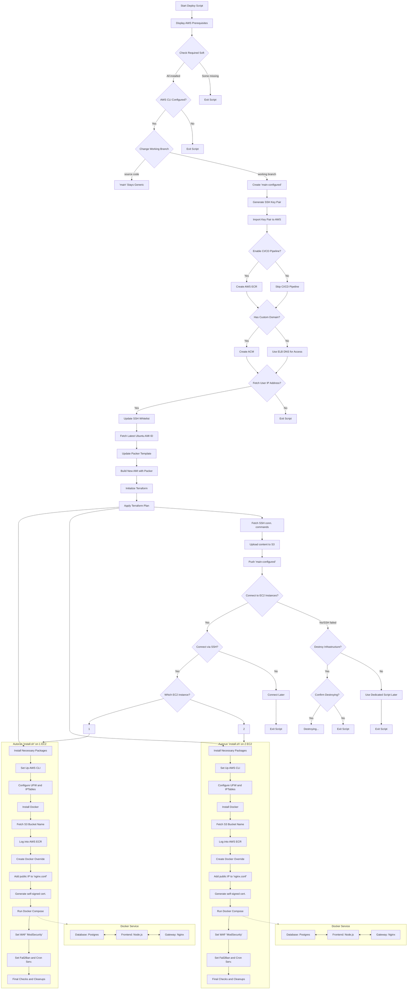
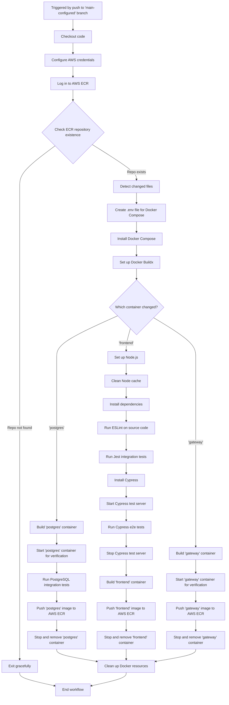
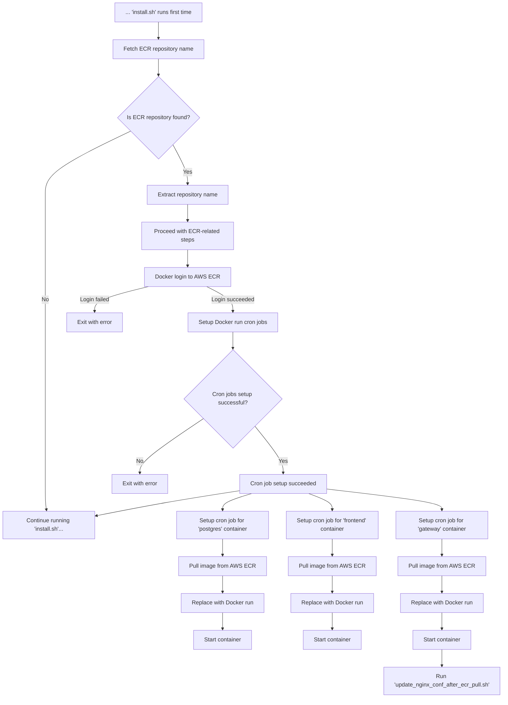

# Automated web application deployment with AWS

## Table of contents
- [Introduction](#Introduction)
    - [Interface](#Interface)
    - [Prerequisites](#Prerequisites)
    - [Architecture](#Architecture)
    - [Technical stack](#technical-stack)
- [General deploying algorithm (local + EC2)](#General-deploying-algorithm)
- [Detailed deploying algorithm on EC2](#detailed-autorun-of-installsh-EC2-part)
- [Project's directories and files](#Projects-directories-and-files)
    - [.github/workflows](#githubworkflows)
    - [configs](#configs)
    - [cypress](#cypress)
    - [docker](#docker)
    - [illustrations](#illustrations)
    - [key](#key)
    - [packer](#packer)
    - [scripts](#scripts)
    - [terraform](#terraform)
    - [utilities](#utilities)
    - [root level files](#root-level-files)
- [Detailed Terraform setup](#Terraform-setup)
    - [AWS EC2 instances](#AWS-EC2-instances)
    - [Application load balancer (ALB)](#Application-load-balancer-ALB)
    - [Target groups](#Target-groups)
    - [IAM roles and policies](#IAM-roles-and-policies)
    - [Security groups](#Security-groups)
    - [S3 bucket](#S3-bucket)
    - [Route 53](#Route-53)
    - [IP whitelisting](#IP-whitelisting)
    - [Outputs](#Outputs)
- [CI/CD pipeline](#CICD-pipeline)
  - [1st part (GitHub Actions)](#GitHub-Actions-workflow)
  - [2nd part (EC2)](#ec2-part-of-workflow)
- [Testing](#Testing)
    - ['frontend' container testing](#frontend-container-testing)
        - [Raw code syntax check (ESLint)](#Raw-code-syntax-check-ESLint)
        - [Integration testing (Jest)](#Integration-testing-Jest)
        - [End-to-End testing (Cypress)](#End-to-End-testing-Cypress)
            - [UI tests](#UI-tests)
            - [Interaction tests](#Interaction-tests)
    - ['postgres' container testing](#postgres-container-testing)
    - ['gateway' container testing](#gateway-container-testing)
- [Future work](#Future-work)
    - [Scalability](#Scalability)
    - [UX](#UX)
    - [Security](#Security)
    - [CI/CD](#CICD)
- [Licensing](#Licensing)
- [Support this project](#support-this-project)

## Introduction
This project is part of my DevOps portfolio, featuring technologies such as [AWS](#Architecture), [Docker](#docker), [Terraform](#Terraform-Setup), [Packer](#packer) [GitHub Actions CI/CD pipelining](#GitHub-Actions-CICD-workflow) and various [testing frameworks](#Testing). It is designed for quick, automated deployment of a full-stack, multi-container web application. The web app demonstrated here is a demo version of a full-scale math quiz application developed within the scope of my other larger [project](https://matematikum.xyz/en/index_en.html). While I’ve implemented some of the security measures used in my original setup, others remain undisclosed for obvious reasons.

The security layers presented in this project include:

- A proactive Web Application Firewall (WAF) using [ModSecurity](./docker/libmodsecurity/);
- A reactive banning system with [Fail2ban](./configs/jail.local) integrated directly with iptables;
- Country-level [GeoIP blocking](./docker/nginx.conf) powered by the MaxMind free GeoLite database;
- A restrictive UFW rule set.

Feel free to experiment with and modify this setup as needed. See licensing conditions [here](#Licensing).

The web app itself is written in [JavaScript](./docker/frontend/server.js) and [HTML](./docker/frontend//public/index.html), running on Node.js within the 'frontend' container, serving as a demonstration of the DevOps processes behind it. However, you're free to replace the 'frontend' container with any other service, app, or static website, and the deployment will proceed in just a few minutes (depending on the size of your application). In the current setup, deployment takes about 30 minutes, with roughly 17 minutes spent compiling a custom Nginx server with third-party libraries (ModSecurity and GeoIP).

The 'frontend' container relies on the 'postgres' container being fully operational, as its logic is tightly integrated with the database. The PostgreSQL [database](./docker/postgres-init/Sample.sql) in this demo contains 40 single- and multiple-choice math questions, taken from a larger set of over 1,000 questions in the full version of my web app. These questions are shuffled and presented randomly in batches of 20 every time the user submits answers and refreshes the page. Additionally, IP blocking is in place on the [backend code](./docker/frontend/server.js) level to prevent abuse, with short-term (15 minutes) and long-term (24 hours) blocks applied to users excessively refreshing the page without interacting with the app's interface (see Image 1).

To start the deployment process, simply run one of the [deploy scripts](#root-level-files) (available in both PowerShell and Bash) located in the root directory. The general deploying algorithm is shown [here](#General-deploying-algorithm).

### Interface
The web app posseses [adaptive interface](./docker/frontend/public/styles.css) and runs smoothly on any device via web browser.

<i>Image 1. Interface of web app</i>

### Prerequisites
- AWS account with programmatic access and required policies (AmazonEC2FullAccess, AmazonS3FullAccess, etc.);
- GitHub Action Secrets configured for automated deployment (AWS credentials, ECR repository, etc.);
- Software installed on local machine where deploy script runs: AWS CLI, Packer, Terraform, Git, SSH.

Run either of [deploy scripts](#root-level-files) for details.

### Architecture
- 2 EC2 instances (Ubuntu) with Docker installed, hosting:
  - Nginx reverse proxy
  - Node.js web application
  - PostgreSQL database
- S3 bucket for storing application assets
- Elastic Load Balancer for traffic distribution
- (Optional) Elastic Container Registry (ECR), Route 53, and Amazon Certificate Manager for domain name and SSL management

### Technical stack
- Infrastructure:
  - [AWS/Terraform](#terraform)
  - [Docker](#docker)
  - [Packer](#packer)
  - [GitHub Actions](#GitHub-Actions-CICD-workflow)
  - [Bash](./deploy.sh)
  - [PowerShell](./deploy.ps1)
  - [Python](./scripts/every_minute_modsec_dump_parsed.py)

- Security:
  - WAF ([ModSecurity](./docker/nginx.conf/), [Fail2ban](./configs/jail.local))
  - [Nginx proxy](./docker/nginx.conf)
  - [GeoIP blocking](./docker/nginx.conf)
  - [Used libraries](./docker/frontend/package.json):
    - helmet 
    - rate-limiter

- Frontend:
  - [HTML](./docker/frontend/public/index.html)
  - [CSS](./docker/frontend//public/styles.css)

- Backend:
  - [Node.js](./docker/frontend/server.js)
  - [Express.js](./docker/frontend/server.js)
  - [PostgreSQL](./docker/postgres-init/Sample.sql)

- Testing:
  - [Jest](#integration-testing-jest)
  - [Cypress](#end-to-end-testing-cypress)
  - [ESlint](#raw-code-syntax-check-eslint)
  - [PostgreSQL](#gateway-container-testing)

## General deploying algorithm

<i>Image 2. General deploying algorithm</i>

## Detailed autorun of '[install.sh](./scripts/install.sh)' (EC2 part)

```mermaid
graph TD;
    A[install.sh executes] --> B[Log setup: define logfile and error handling]
    B --> C[Preconfigure iptables-persistent]
    C --> D[Read allowed IPs from file: allowed_aws_regional_ips.txt]
    D --> E[Configure passwordless sudo for 'ubuntu' user]
    
    E --> F[Update system packages]
    F --> G[Install necessary packages: Fail2ban, Docker, AWS CLI, UFW, OpenSSH, etc.]
    G --> H[Verify AWS CLI installation]
    
    H --> I[Configure UFW firewall]
    I --> J[Set default deny for incoming traffic]
    J --> K[Allow ports: 22, 80, 443, 3000]
    K --> L[Whitelist SSH access for allowed IPs]
    L --> M[Save iptables rules for reboot persistence]

    M --> N[Install Docker]
    N --> O[Start Docker service]
    O --> P[Verify Docker installation with hello-world container]
    P --> Q[Add 'ubuntu' user to Docker group]

    Q --> R{Check for AWS ECR}
    R -- No AWS ECR found --> W
    R -- AWS ECR found --> S2[Login to AWS ECR]

    S2 --> U[Set up cron jobs for Docker containers' updates]
    U --> W[Run Nginx config update script]
    W --> X[Build and start Docker containers with Docker Compose]
    X --> Y[Set Docker containers to restart on reboot]

    Y --> Z[Configure ModSecurity and Fail2Ban]
    Z --> AA[Create Fail2Ban jail and filter files]
    AA --> AB[Create ModSecurity log files]

    AB --> AC[Configure SSH service]
    AC --> AD[Enable SSH, generate host keys if needed]
    AD --> AE[Disable root login for SSH]
    AE --> AF[Restart Docker, Fail2ban, SSH, and cron services]

    AF --> AG[Check and log UFW status]
    AG --> AH[Check and log Docker service status]
    AH --> AI[Check and log Fail2ban status]
    AI --> AJ[Check cron job status]

    AJ --> AK[Cleanup sensitive information and lock down permissions]
    AK --> AL[Display disk space usage]

    AL --> AM{Were there errors?}
    AM -- Yes --> AN[Log errors in install_script.log]
    AM -- No --> AO[Log success message in install_script.log]

    AO --> AP[End of install.sh script execution]
    AN --> AP
```

<i>Image 3. Detailed autorun of 'install.sh' (EC2 part)</i>

## Project's directories and files
### .github/workflows
[docker-deploy.yml](./.github/workflows/docker-deploy.yml): this directory contains GitHub Actions [workflow](#GitHub-Actions-CICD-workflow) file, defining the CI/CD pipeline to build, test, and deploy Docker containers to AWS ECR. It automates tasks such as setting up AWS credentials, building Docker images, and running tests.

### configs
[jail.local](./configs/jail.local): this is the configuration file for Fail2ban, defining jail rules to monitor and block suspicious IPs based on logs. The IP addresses included at the beginning are whitelisted user's IP and IP ranges of EU and US AWS regions to enable 'EC2 instance connect' feature, as a back up way for connecting to EC2 isntances.

### cypress
- [integration](./cypress/integration): contains test files for Cypress that run e2e (UI and interaction) tests:
  - [ui.spec.js](./cypress/integration/ui/ui.spec.js): focuses on testing static elements on the frontend;
  - [interaction.spec.js](./cypress/integration/interaction/interaction.spec.js): handles dynamic element testing such as user interactions and quiz logic;
  - [plugins](./cypress/plugins): Cypress plugins to extend Cypress functionality;
  - [support](./cypress/support): additional utilities and configuration files to support Cypress tests;
  - [cypress.config.js](./cypress/cypress.config.js): cypress configuration file that manages test setup, plugins, and environment configurations.

### docker
- [frontend](./docker/frontend/): contains the frontend source code and tests:
  - [certs](./docker/certs/): placeholder directory that gets populated with a self-signed certificate and key on each provisioned EC2 instance if no custom domain is provided during the local deployment phase. If a custom domain is specified, the custom certificate and key are uploaded to AWS Certificate Manager (ACM) during the local phase of deployment from the user's machine;
  - [tests](./docker/frontend/__tests__): integration tests run by Jest:
    - [server.test.js](./docker/frontend/__tests__/server.test.js): integration testing of the backend API; fetches and validates questions and their options, verifies the existence of illustrations;
    - [illustrations.json](./docker/frontend/__tests__/illustrations.json): a list of illustration filenames used for verifying the existence of specific images within the [illustrations](./illustrations/) folder during tests;
  - [index.html](./docker/frontend/public/index.html): main HTML file of the frontend web application;
  - [api.test.js](./docker/frontend/api.test.js): Jest testing file for validating frontend API calls;
  - [Dockerfile.dev](./docker/frontend/Dockerfile.dev): Dockerfile for building the 'frontend' container;
  - [package.json](./docker/frontend/package.json): contains the dependencies and scripts required to build and run the frontend;
  - [server.js](./docker/frontend/server.js): backend server logic for serving the frontend or handling API requests;
- [geoip_db](./docker/geoip_db/): this directory should contain proprietary GeoLite2 IP country-level database '.mmdb' from MaxMind; you can register there and get your copy of database with follow up updates for free;
- [libmodsecurity](./docker/libmodsecurity/): holds ModSecurity-related files for web application firewall (WAF) setup;
- [postgres](./docker/postgres/): contains Dockerfile for building the 'postgres' container;
- [postgres-init](./docker/postgres-init/): contains 40 questions demo 'Sample' database for setting up the 'postgres' container;
- [docker-compose-dev.yml](./docker/docker-compose-dev.yml): Docker Compose file for running the multi-container development environment;
- [Dockerfile.nginx](./docker/Dockerfile.nginx): Dockerfile for setting up the 'gateway' container for serving 'frontend' and reverse proxy;
- [nginx.conf](./docker/nginx.conf): Nginx configuration file with server and proxy settings;
- [test_db.sql](./docker/test_db.sql): set of SQL commands for testing the database schema and validating 'Sample' database's content.

### [illustrations](./illustrations/)
Stores illustration assets for the web app, which will be uploaded to an S3 bucket during the deployment process.

### key
Stores public and private SSH keys for secure access to the provisioned EC2 instances (not included, generated by deploy script):
- my-local-key-pair.pem: Private key for SSH connections;
- my-local-key-pair.pub: Public key for SSH connections.

This directory is excluded in .gitignore from being committed to GitHub repository, so public key movement happens only between your machine and provisioned EC2 instances. Private key, of course, always stays on your machine.
### packer
- [packer-template.json](./packer/packer-template.json): Packer template defines what files will be baked inside AMI (and, thus, OS). It is used for continuing deploying process on provisioned EC2, particularly by including in AMI autorun '[install.sh](./scripts/install.sh)' script.

### scripts
- [install.sh](#detailed-autorun-of-installsh-EC2-part): this is the main script that runs on the EC2 instance, handling all configurations and installations (e.g., Docker, UFW, Fail2ban);
- [every_min_dump.sh](./scripts/every_min_dump.sh): shell script providing gathering docker logs from 'gateway' container and dumping them into special log file once per minute;
- [every_minute_modsec_dump.sh](./scripts/every_minute_modsec_dump.sh): shell scripts related to logging and ModSecurity raw dumps;
- [every_minute_modsec_dump_parsed.py](./scripts/every_minute_modsec_dump_parsed.py): Python script that parses ModSecurity raw dumps into format readable for Failban banning system;
- [update_nginx_conf.sh](./scripts/update_nginx_conf.sh): script that for the first on new EC2 updates the '[nginx.conf](./docker/nginx.conf)' with the instance's public IP, generates self-signed SSL certificate with respective key and palces them inside 'gateway' container;
- [update_nginx_conf_after_ecr_pull.sh](/scripts/update_nginx_conf_after_ecr_pull.sh): script that updates the Nginx configuration with the instance's public IP, tests syntax of '[nginx.conf](./docker/nginx.conf)' and restarts the updated container built from 'gateway' image [pulled from AWS ECR](#ec2-part-of-workflow).

### terraform
Contains all Terraform configurations for provisioning AWS resources (see detailed description [here](#Terraform-Setup)):
- [main.tf](./terraform/main.tf): main Terraform configuration file that defines the EC2 instances;
- [elb.tf](./terraform/elb.tf): defines the AWS Application Load Balancer and its listeners;
- [iam.tf](./terraform/iam.tf): defines the IAM roles and permissions for the EC2 instances;
- [ip_ranges.tf](./terraform/ip_ranges.tf): manages the IP ranges allowed for EC2 Instance Connect;
- [output.tf](./terraform/output.tf): defines output values such as DNS names and instance IDs after provisioning;
- [provider.tf](./terraform/provider.tf): specifies the AWS provider for Terraform to interact with AWS resources;
- [route53.tf](./terraform/route53.tf): configures Route 53 for DNS management;
- [s3.tf](./terraform/s3.tf): provisions the S3 bucket for storing web app assets;
- [security_groups.tf](./terraform/security_groups.tf): defines security group rules for the web application.

### utilities
Contains additional utility scripts for managing deployed infrastructure:
- [destroy.ps1](./utilities/destroy.ps1): PowerShell script for automatic deleting the entire provisioned AWS infrastructure; 
- [destroy.sh](./utilities/destroy.sh): Bash script for automatic deleting the entire provisioned AWS infrastructure;
- [test_aws_balancer.sh](./utilities/test_aws_balancer.sh): Bash script for testing the provisioned Application Load Balancer (ALB).

### root level files
- [deploy.ps1](./deploy.ps1): PowerShell script for automating the deployment process; 
- [deploy.sh](./deploy.sh): Bash script for automating the deployment process; 
- [jest.config.js](./jest.config.js): configuration for Jest used for integration testing in the project;
- [.eslintrc.json](./.eslintrc.json): configuration for ESLint used for source code syntax check in the project;
- Readme.md: documentation file (you are reading it right now).

## Terraform setup
### AWS EC2 instances
([file](./terraform/main.tf))
- aws_instance.web_app_instance: provisions two EC2 instances using a custom AMI. The instances are configured to automatically run the '[install.sh](./scripts/install.sh)' script in the background using user data. The instances are associated with an IAM role to allow access to AWS services, and they are secured by a VPC security group. Public subnets are dynamically chosen for each instance.

### Application load balancer (ALB)
([file](./terraform/elb.tf))
- aws_lb.web_app_alb: creates an external application load balancer to distribute incoming traffic to the EC2 instances. The ALB is associated with a security group and spans across public subnets in the default VPC. Two listeners are configured:
  - aws_lb_listener.http: handles HTTP requests, either forwarding traffic to the target group or redirecting to HTTPS (based on SSL certificate availability).
  - aws_lb_listener.https: handles HTTPS requests if an SSL certificate is provided. It forwards traffic to the secure target group.

### Target groups
([file](./terraform/elb.tf))
- aws_lb_target_group.http/https: these manage the HTTP and HTTPS traffic. Each target group is connected to the EC2 instances and performs health checks on the [/healthcheck](./docker/nginx.conf) endpoint to ensure instances are available and healthy.

### IAM roles and policies
([file](./terraform/iam.tf))
- aws_iam_role.ec2_role: defines an IAM role with permissions for EC2, S3, ECR, and EC2 Instance Connect services.
- aws_iam_instance_profile.ec2_instance_profile: links the IAM role to the EC2 instances, granting them the necessary permissions to interact with AWS services.

### Security groups
([file](./terraform/security_groups.tf))
- aws_security_group.web_app_sg: configures security rules for the EC2 instances and ALB, allowing traffic on ports 22 (SSH), 80 (HTTP), 443 (HTTPS), 3000, and 9999. It includes additional rules to allow EC2 Instance Connect for specific IP ranges.

### S3 bucket
([file](./terraform/s3.tf))
- aws_s3_bucket.web_app_bucket: creates an S3 bucket to store web application assets, such as graphical files. The bucket is tagged and will be destroyed along with the infrastructure.

### Route 53
([file](./terraform/route53.tf))
- aws_route53_zone.web_app_zone: configures a Route 53 DNS zone for the application domain, if a domain name is provided.
- aws_route53_record.web_app_record: creates a DNS A-record to route traffic to the ALB, associating the domain name with the ALB DNS.

### IP whitelisting
([file](./terraform/ip_ranges.tf))
- ip_ranges.tf: defines a set of CIDR blocks representing AWS region-specific IP ranges and the user's public IP. These are used to allow SSH access via EC2 Instance Connect.

### Outputs
([file](./terraform/output.tf))
- captures and outputs important details such as the ALB DNS name, instance IDs, instance public IPs, and the dynamically generated S3 bucket name. This information is used for configuration and deployment steps.

## CI/CD pipeline
It consists of two parts:

  1. GitHub Actions -> AWS ECR
  2. AWS ECR -> AWS EC2

### GitHub Actions workflow
This [workflow](./.github/workflows/docker-deploy.yml) automates the process of building and testing Docker containers within the GitHub Actions environment whenever changes are pushed to the 'main-configured' branch, followed by deploying the corresponding images to AWS ECR:

<i>Image 4. GitHub Actions workflow</i>

### EC2 part of workflow
The second part of the CI/CD pipeline, outlined in '[install.sh](./scripts/install.sh)', automates the pulling of the respective images from AWS ECR, along with building and testing (for 'gateway') the containers on AWS EC2 instances:

<i>Image 5. EC2 part of workflow</i>

## Testing
### 'frontend' container testing
Within the scope of this project only the 'frontend' container undergoes the most thorough testing with source code checks ([ESLint](./.eslintrc.json), [Jest](./jest.config.js)) and end-to-end tests in near-real conditions ([Cypress](./cypress/cypress.config.js)):
#### Raw code syntax check (ESLint)
- [.eslintrc.json](./.eslintrc.json): runs across the codebase to detect potential syntax errors and code style violations before building containers.

#### Integration testing (Jest)
- [api.test.js](./docker/frontend/api.test.js): tests the behavior of API endpoints ([GET /api/questions, POST /api/check-answers](./docker/frontend/server.js)) with 42 total tests, focusing on endpoint functionality and response structure;
- [server.test.js](./docker/frontend/__tests__/server.test.js): tests the server's response to requests, ensures static files and questions are handled correctly with 41 total tests.

#### End-to-End testing (Cypress)
##### UI tests
- [ui.spec.js](./cypress/integration/ui/ui.spec.js): tests the static elements of the page, ensures correct visibility of buttons (Check/Refresh) and loading indicators (basic page structure, static content validation).
##### Interaction tests
- [interaction.spec.js](./cypress/integration/interaction/interaction.spec.js): tests dynamic elements such as user interactions with quiz questions and options, validates the correctness of input types (radio/checkbox) are rendered and that buttons are enabled based on user input (ensures interactive elements behave as expected, including option selection and question-answer validation).

### 'postgres' container testing
The 'postgres' container's '[Sample](./docker/postgres-init/Sample.sql)' database is validated for integrity and accuracy using a custom [SQL script](./docker/test_db.sql):
- [test_db.sql](./docker/test_db.sql): checks the '[Sample](./docker/postgres-init/Sample.sql)' database against set of defined rules, verifies the schema, table and column existence, and ensures the correct number of records (40 questions, 160 options) are present in the database, providing detailed error messages in case of discrepancies.

### 'gateway' container testing
The 'gateway' container is verified within the GitHub Actions workflow and tested for '[nginx.conf](./docker/nginx.conf)' syntax correctness on each EC2 instance after [pulling the 'gateway' image from AWS ECR](#ec2-part-of-workflow):
- Validation: brings 'gateway' container up after it is built during the GitHub Actions workflow run;
- Nginx syntax check: carried out individually on each provisioned EC2 instance after 'gateway' container is pulled from AWS ECR. 

## Future work
### Scalability
- Dynamically adjust the number of provisioned EC2 instances based on user input (as opposed to 2 hardcoded EC2 instances now);

### UX
- In deploy scripts automatically assign single core IAM policy and fetch additional policies without prior manual work in AWS account;
- Replace self-signed certificates with "Let's Encrypt" when no custom domain is provided to eliminate browser warnings;

### Security
- Automate and schedule periodic updates (twice a week) for the MaxMind GeoIP database used by the ModSecurity module on the Nginx server;

### CI/CD
- Integrate a notification system (e.g., Postfix server on EC2 + AWS SES) to alert when updates are available in the pipeline;
- In the deploy script automate lifecycle policy attachment for AWS ECR images, so they would not incur storage charges;
- In GitHub Actions workflow implement container rebuild caching to improve efficiency;
- In GitHub Actions workflow update to the latest versions all deprecated modules (if any).

## Licensing
This work is licensed under the GNU General Public License v3.0 ([GPLv3](https://www.gnu.org/licenses/gpl-3.0.en.html)).

- You are free to use, modify, and distribute this software, as long as any modified versions are also distributed under the same GPL license.
- You must give appropriate credit to the original author.
- This software is distributed without any warranty; without even the implied warranty of merchantability or fitness for a particular purpose.

For the full terms, see the [LICENSE](./LICENSE.txt) file in this repository or visit [https://www.gnu.org/licenses/gpl-3.0.html](https://www.gnu.org/licenses/gpl-3.0.html).

## Support this project
If you enjoyed this project or found it useful, consider supporting me! Your donations help me to maintain and develop future improvements.

